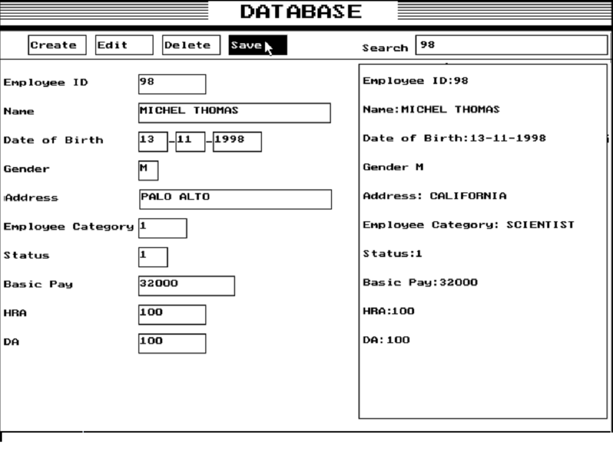

# GUIFileProcessingSystem_dosbox

A GUI File processing system written for Dosbox that implements the event driven model written entirely using C++.
I developed this from scratch as my CS project for 12th grade(2017), CBSE.
I started off with the aim of creating generic and reusable components but due to the time constraints
I was forced to churn out functional code and ignore pragmatics.

## Overview
  It is fairly easy to build this program.
  You will require the dosbox emulator with turbo c++ installed on it. 
  Create a project file and include all the files from the source directory.
  
    The following object files are required for the successful build of the project.
      EGAVGA.OBJ   - Required for the successful execution of graphics functions.
      SANS.OBJ     - Font Style required by the program. 
      TRIP.OBJ     - Font Style required by the program.
      
   
      
  
# Author

 Michel Thomas
 
# License
 
 GNU General Public License, version 2

# Acknowledgments

 Let us C by Yashavant Kanetkar.
 
 Object Oriented Programming with C++ by Robert Lafore.
